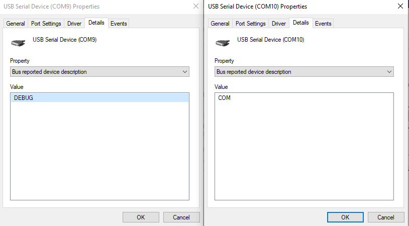

# OpenDIAG User Manual

This manual covers setting up and using the OpenDIAG adapter.

---

## Specifications

| | |
| --- | --- |
| Processor | ESP32-S3, 16 MB flash, 8 MB PSRAM |
| Vehicle protocols | CAN (ISO 15765-4), K-Line and L-Line (ISO 9141-2, ISO 14230-4 KWP), SAE J1850 PWM, SAE J1850 VPW |
| CAN transceivers | 2 (one on the OBD-II connector, one on the auxiliary port) |
| Host interfaces | USB (two virtual serial ports) and Bluetooth Low Energy |
| Host protocols | ELM327 AT commands, SAE J2534 pass-thru, SLCAN |
| Vehicle supply input | 10 V – 26 V from OBD-II pin 16 |
| High-side drivers | 6, on OBD-II pins 6, 9, 11, 12, 13, 14 |
| Low-side driver | 1, on OBD-II pin 15 |
| Programming voltage | Adjustable boost converter, 5 V – 20 V, feeds the high-side drivers |
| Sensing | Battery voltage, high-side output voltage |
| User interface | RGB status LED, one push button |

---

## Safety

- **Work on a stationary vehicle.** Park somewhere the car can stay put, with the parking brake
  set. Never operate the adapter while driving.
- **Use a stable supply for reprogramming.** A module that loses power mid-flash may stop
  responding. Connect a battery maintainer before flashing, and don't rely on the vehicle battery
  alone.
- **A pulsing amber LED means a connector pin is energised.** Pins are released when the client
  that raised them disconnects. A pin raised from the debug shell stays on until you release it
  there. See [Releasing pins and buses](#releasing-pins-and-buses).
- **Only work on vehicles you own or are authorised to modify.** Changing emissions-related
  calibrations is regulated in many places.

---

## The device at a glance

### Status LED

| LED | Meaning |
| --- | --- |
| Breathing cyan | Normal operation, ready |
| Blinking blue | Bluetooth pairing window is open |
| Pulsing amber | At least one OBD-II connector pin is energised by the adapter |
| Off | No power, or the adapter is in firmware-download mode |

### Button

| Action | Result |
| --- | --- |
| Hold for about 2 seconds | Opens the **Bluetooth pairing window** for 60 seconds (LED blinks blue) |
| Keep holding, to about 10 seconds | **Forgets every paired phone**, and leaves the pairing window open |
| Hold while plugging in USB | Starts **firmware-download mode** (see [Updating the firmware](#updating-the-firmware)) |

### Connectors

- **OBD-II plug** – connects to the vehicle's diagnostic port.
- **USB-C** – connects to a computer and provides the serial ports. It can also power the adapter
  (see [Power](#power)).
- **Auxiliary CAN port** (side of the unit) – connects to the second CAN transceiver.

---

## Power

The adapter runs from either the OBD-II port or USB:

- **OBD-II port:** Takes power from the vehicle battery (pin 16). This is all you need for
  Bluetooth use.
- **USB:** Powers the adapter from a computer when it isn't plugged into a car. This is useful on
  the bench.

Both can be connected at the same time. When they are, the adapter runs from the OBD-II port.

---

## One data link, two ways to reach it

OpenDIAG has **one** data link, and it runs over either USB or Bluetooth. It doesn't use both at
once. **The first one to connect gets it.** The other one can connect, but it gets no answer until
the first one disconnects.

A computer that keeps the USB data port open therefore locks out a phone. To hand the link to the
phone without closing the port, type `link ble` in the [debug shell](#the-debug-shell). To let
whichever connects next take it, type `link drop`.

Whenever the client holding the link disconnects, the adapter starts over. The link goes back to
ELM327 mode, its settings are cleared, and every bus and pin that client opened is released. The
next client always starts from a known state.

---

## Connecting over USB

Plug the adapter into a computer. It shows up as a USB device named **OpenDiag** with two serial
ports:

| Port | Name | Use |
| --- | --- | --- |
| Data port | COM | Choose this port in your OBD-II, J2534 or SLCAN software. |
| Debug port | DEBUG | Use this port to enter commands in [the debug shell](#the-debug-shell). |

Windows 10 and 11, macOS, and Linux need no driver. Windows XP needs the INF that ships with the
[J2534 driver package](#j2534-pass-thru-on-windows). These are virtual serial ports, so the baud
rate you pick doesn't matter. The lower-numbered port is not always the data port. Follow the
steps for your operating system below to find the right one.

### Linux

Open a terminal and paste this command:

```sh
ls -l /dev/serial/by-id/usb-Maximus64_OpenDiag_*-if0*
```

For example, an adapter with serial number `1051DB7B22EC` may appear as:

```text
usb-Maximus64_OpenDiag_1051DB7B22EC-if00 -> ../../ttyACM0
usb-Maximus64_OpenDiag_1051DB7B22EC-if02 -> ../../ttyACM1
```

| Name ends with | Choose it for |
| --- | --- |
| `-if00` | Diagnostic software (**COM**) |
| `-if02` | Debug commands (**DEBUG**) |

In your diagnostic software, use the full name starting with `/dev/serial/by-id/` and ending
with `-if00`. This name stays the same even if Linux assigns a different `ttyACM` number later.
If the software only lists `ttyACM` ports, choose the one shown after the arrow on the `-if00`
line — `/dev/ttyACM0` in this example. Your number may be different.

If several OpenDIAG adapters are connected, their serial numbers distinguish them.

### macOS

Open **Terminal** and paste this command. It lists the adapter's port details without connecting
to either port:

```sh
ioreg -r -n OpenDiag -l -w 0 |
  grep -E '\+-o|USB Serial Number|bInterfaceNumber|IOCalloutDevice'
```

The output contains several sections. To find the port for your diagnostic software:

1. Find the line containing `"bInterfaceNumber" = 1`.
2. In that section, find the `IOCalloutDevice` line below it.
3. Copy the name beginning with `/dev/cu.` into your diagnostic software's port setting.

For example, this shortened output identifies `/dev/cu.usbmodem12301` as the data port:

```text
    "bInterfaceNumber" = 1
        "IOCalloutDevice" = "/dev/cu.usbmodem12301"
```

Your port name will be different. For the **debug port**, follow the same steps using
`"bInterfaceNumber" = 3`. If several OpenDIAG adapters are connected, check the
`USB Serial Number` line to find the one you want.

### Windows

1. Open **Device Manager** and expand **Ports (COM & LPT)**.
2. Right-click one of the adapter's ports and choose **Properties**.
3. Open the **Details** tab and select **Bus reported device description** from the list.
4. If the value is **COM**, choose this port in your diagnostic software. **DEBUG** is for
   debug commands.

In the example below, COM9 is the debug port and COM10 is the data port. Your port numbers may
differ.



---

## Connecting over Bluetooth LE

Bluetooth is protected by pairing. A phone has to be paired while you're at the adapter, and after
that only paired phones can find it or connect to it.

### Pairing a phone

1. Plug the adapter into the car.
2. Hold the button for about 2 seconds, until the LED blinks blue. The pairing window is now open
   for 60 seconds.
3. In your app, connect to **OpenDIAG**. Your phone may ask you to confirm pairing. There's no
   PIN to enter.
4. The LED returns to cyan once the phone is paired.

After that, the phone reconnects on its own without the button. The adapter remembers up to 8
phones.

**A new adapter is invisible.** It doesn't advertise at all until the first time you open the
pairing window. After a phone is paired, the adapter only shows up for, and only accepts, phones it
already knows.

### Removing phones

Hold the button for about 10 seconds, or type `ble forget` in the debug shell. That forgets
**every** paired phone, which is also how to hand the unit to someone else. If a phone was told to
"forget this device" but the adapter still remembers it, the two won't agree on a key. Forget on
the adapter too, and then pair again.

`ble` in the debug shell shows how many phones are paired, whether the pairing window is open, and
whether one is connected. `ble pair` opens the pairing window from the shell.

### For app developers: GATT layout

One primary service carries three characteristics. It follows the Nordic UART layout, plus a
control characteristic.

| UUID | Properties | Purpose |
| --- | --- | --- |
| `6E400001-B5A3-F393-E0A9-E50E24DCCA9E` | service | |
| `6E400002-B5A3-F393-E0A9-E50E24DCCA9E` | write, write without response | Data, app → adapter |
| `6E400003-B5A3-F393-E0A9-E50E24DCCA9E` | notify | Data, adapter → app |
| `6E400004-B5A3-F393-E0A9-E50E24DCCA9E` | write, write without response, notify | [Control commands](#control-commands) |

All three characteristics need an encrypted, bonded connection. Notifications are split to fit the
negotiated MTU, so request a larger MTU for better throughput.

---

## Using OpenDIAG with an OBD-II app (ELM327)

Any app or program that supports an ELM327 adapter should work, over USB or over Bluetooth LE.
Apps that only support *Bluetooth Classic* ELM327 adapters won't find it. Look for BLE or
"Bluetooth 4.0" support in the app. The adapter identifies itself as `ELM327 v2.3`.

1. Plug OpenDIAG into the vehicle's OBD-II port. The LED breathes cyan.
2. Over Bluetooth, [pair your phone](#pairing-a-phone) if you haven't already.
3. Turn the ignition on. You can start the engine if your app requires it.
4. In your app, choose an ELM327 adapter and select either the data serial port or the
   **OpenDIAG** Bluetooth device.
5. Connect.

### Supported protocols

| `AT SP` | Protocol | Status |
| --- | --- | --- |
| 0 | Automatic | ✅ |
| 1 | SAE J1850 PWM (41.6 kbaud) | ✅ |
| 2 | SAE J1850 VPW (10.4 kbaud) | ✅ |
| 3 | ISO 9141-2 (5-baud init) | ✅ |
| 4 | ISO 14230-4 KWP (5-baud init) | ✅ |
| 5 | ISO 14230-4 KWP (fast init) | ✅ |
| 6 | ISO 15765-4 CAN 11-bit, 500 kbaud | ✅ |
| 7 | ISO 15765-4 CAN 29-bit, 500 kbaud | ✅ |
| 8 | ISO 15765-4 CAN 11-bit, 250 kbaud | ✅ |
| 9 | ISO 15765-4 CAN 29-bit, 250 kbaud | ✅ |
| A–C | J1939, USER1, USER2 | not yet |

Automatic search tries CAN first (500k before 250k), then K-Line, then J1850. Setting a protocol
by hand skips the search and connects faster. `AT SS` switches to the SAE J1978 order, which
starts with J1850.

The full list of supported AT commands is in [at_commands.md](at_commands.md).

### OpenDIAG extensions

These commands aren't part of the ELM327 set:

| Command | What it does |
| --- | --- |
| `AT PROGV p vvvvvvvv` | Drive OBD-II pin `p` (one hex digit: `6`, `9`, `B`=11 … `F`=15). `vvvvvvvv` is the voltage in millivolts, in hex, for example `00002EE0` for 12 V. `FFFFFFFE` grounds a low-side pin, and `FFFFFFFF` releases the pin. |
| `AT VIF PASSTHRU` | Switch the link to J2534 mode. The J2534 driver sends this for you. |
| `AT VIF SLCAN` | Switch the link to SLCAN mode. |

---

## J2534 pass-thru on Windows

OpenDIAG works as an SAE J2534 pass-thru interface, so Windows diagnostic and reprogramming
software can drive it directly. The driver is 32-bit and provides both API versions:

| DLL | API |
| --- | --- |
| `opendiag32.dll` | J2534-1 05.00 |
| `odg40432.dll` | J2534-1 04.04 |

It runs on Windows XP SP3 through Windows 11, including 64-bit Windows, for **32-bit
applications**. That covers nearly all J2534 software. A native 64-bit application can't load it.

### Protocols

| J2534 protocol | Baud rates |
| --- | --- |
| CAN, ISO 15765 | 50k, 125k, 250k, 500k, 1M |
| J1850 PWM | 41.6k |
| J1850 VPW | 10.4k |
| ISO 9141, ISO 14230 | K-Line, with L-Line on pin 15 unless the application asks for K-only |

Battery voltage reads, programming voltage on the connector pins, and periodic messages are
supported. This is a working subset of J2534, not a certified implementation. SCI isn't supported.

### Installing

1. Download `opendiag-j2534-driver.zip` from the
   [releases page](https://github.com/maximus64/opendiag-firmware/releases).
2. Close any diagnostic applications.
3. Extract the ZIP, keeping its files together.
4. Run `install.cmd` from an **administrator** command prompt. It copies everything to
   `C:\OpenDIAG` and registers the device with Windows' J2534 registry.
5. **Windows XP only:** install the USB driver for the two serial ports. When the Found New
   Hardware wizard appears, choose to install from a specific location and point it at
   `C:\OpenDIAG`. The full steps are in `README.txt` in the ZIP.
6. Run `C:\OpenDIAG\opendiag_config.exe`. Select the adapter's **data** COM port, not the debug
   port, then click **Save & Test**.

Your diagnostic software should now list **OpenDIAG** as a pass-thru device. The driver switches
the adapter into J2534 mode when the software connects, and the adapter goes back to ELM327 when
it disconnects.

The configuration utility can also connect over **TCP/IP**, for use with a serial-to-network
bridge.

To uninstall, run `C:\OpenDIAG\uninstall.cmd` as administrator. Your settings file and logs are
kept.

---

## SLCAN mode for developers

SLCAN (the LAWICEL protocol) gives you raw CAN frames without the ELM327 layer. You can use it with
Linux SocketCAN (`slcand`), SavvyCAN, python-can, and similar tools for sniffing, custom UDS
requests, and ECU flashing.

The link starts in ELM327 mode, and `slcand` can't switch it for you, so switch it first from the
debug shell:

```
mode slcan
```

Then attach your tool to the **data** port. On Linux, for example:

```bash
sudo slcand -o -s6 -t hw /dev/ttyACM0 can0   # -s6 = 500 kbit/s
sudo ip link set up can0
candump can0
```

A tool that talks to the port itself can instead send `AT VIF SLCAN`, wait for `OK`, and carry on
in SLCAN.

Supported bit rates:

| Command | Rate |
| --- | --- |
| `S2` | 50 kbit/s |
| `S4` | 125 kbit/s |
| `S5` | 250 kbit/s |
| `S6` | 500 kbit/s |
| `S8` | 1 Mbit/s |

The adapter refuses other rates rather than substituting a nearby one.

---

## Switching modes

The data link runs one of three modes at a time: **elm327** (the default), **j2534**, or
**slcan**.

| From | How to switch |
| --- | --- |
| Debug shell | `mode <name>`, for example `mode slcan` |
| BLE control characteristic | `MODE=<name>` |
| Inside ELM327 | `AT VIF PASSTHRU` or `AT VIF SLCAN` |

Keep in mind:

- **Switching modes is a fresh start.** Every bus and pin the link holds is released on the way
  through. Set up programming voltages *after* you switch, from the mode that will use them.
- **The mode reverts when the client disconnects.** Closing the data port or dropping the BLE
  connection puts the link back in ELM327 mode. That keeps an ordinary OBD app working next time
  without anyone switching it back.
- **Switch before you open the port.** Opening the port doesn't reset the mode. `mode slcan`
  followed by starting `slcand` works as expected.
- **The mode doesn't survive a power cycle.** After a reboot, the link starts in ELM327 mode.

---

## Control commands

Control commands manage the data link without going through its data stream. You can reach them
from two places:

- **USB:** in the debug shell, type `ctrl <command>`.
- **Bluetooth:** write one command to the control characteristic (`…0004`). The reply comes back
  as a notification on the same characteristic.

| Command | Example reply | What it does |
| --- | --- | --- |
| `ID` | `OpenDiag rev1 fw=… link=… mode=elm327 modes=…` | Identifies the adapter, its firmware, and the available modes |
| `MODE` | `MODE elm327` | Shows the current mode |
| `MODE=<name>` | `MODE slcan` | Switches mode, releasing every bus and pin the link holds |
| `BUS` | `BUS can@500000/link` | Lists every open vehicle bus, its bit rate, and who holds it (`link` or `shell`) |
| `RESET` | `RESET elm327` | Releases the link's buses and pins and goes back to ELM327 |

Commands are case-insensitive. A failed command replies with `ERR` and a reason.

---

## The debug shell

Open the **DEBUG** USB serial port in any terminal program, such as PuTTY, screen,
minicom, `idf.py monitor`, or `python tools/serial_term.py`, which adds highlighting. Type `help`
for the list of commands.

### Everyday commands

| Command | Description |
| --- | --- |
| `help` | List all commands |
| `version` | Show the firmware version and build |
| `board` | Show board information |
| `link` | Show which transport holds the data link |
| `link usb` / `link ble` / `link drop` | Hand the data link to USB or Bluetooth, or let go of it |
| `mode` | Show the current mode, the default, and every available mode |
| `mode <name>` | Switch mode, for example `mode slcan` |
| `ctrl <command>` | Run a [control command](#control-commands) |
| `ble` | Show pairing status |
| `ble pair` | Open the Bluetooth pairing window |
| `ble forget` | Forget every paired phone |
| `vif` | Show open buses, energised pins, and who holds each |
| `vbatt` | Show the vehicle battery voltage |
| `reboot` | Restart the adapter |
| `reboot dl` | Restart into firmware-download mode |

### Hardware and bring-up commands

> [!CAUTION]
> These commands drive the connector directly. Check which pins your vehicle uses before you
> energise anything.

| Command | Description |
| --- | --- |
| `hsset <pin> <mV>` | Drive high-side OBD pin 6, 9, 11, 12, 13 or 14 at 5000–20000 mV. `0` turns it off. |
| `lsset <pin> <1\|0>` | Ground (`1`) or release (`0`) a low-side pin: 15 |
| `pinoff` | Release every pin the shell holds |
| `hsvsense` | Show the measured high-side output voltage |
| `kline …`, `j1850 …`, `vpw …`, `can …` | Per-bus test tools. Run one with no arguments, or see `help`, for its options. |
| `comm`, `heap`, `tasks` | Internal diagnostics |
| `hscal`, `vbattcal`, `calset` | Factory voltage calibration. **Don't run these unless you're recalibrating the unit**, because they overwrite its stored calibration. |

The adapter allows only one high-side pin and one low-side pin at a time, as SAE J2534
specifies. It refuses a request that would break this rule, or one that would take over a pin
someone else holds. Pin 15 is also refused while a K-Line session is using it as the L-Line.

---

## Releasing pins and buses

What the data link holds is released automatically:

- when the client **disconnects** (closes the port or drops Bluetooth)
- when the link **switches mode**
- on **`RESET`**, the [control command](#control-commands)
- on **`AT Z`** in ELM327 mode, or when the J2534 application closes the device

What the **debug shell** holds stays on until you release it there with `pinoff` (or `hsset <pin>
0` / `lsset <pin> 0`), or until you power-cycle the adapter.

If the LED is pulsing amber and you don't know why, type `vif` in the shell to see who holds the
pin.

---

## Updating the firmware

To update the firmware, go to **[the OpenDIAG firmware update page](update/index.html)**
and follow the instructions there.

### Updating manually

If you'd rather flash the firmware yourself, releases are published as `opendiag-firmware.zip` on the
[releases page](https://github.com/maximus64/opendiag-firmware/releases). The ZIP holds the flash
images, a `manifest.json` that lists the address for each one, and `SHA256SUMS`.

1. Unplug the adapter from the vehicle.
2. Hold the button while you plug in the USB cable, then release it. You can also type
   `reboot dl` in the debug shell. The LED stays off, and the adapter appears as a single
   **USB JTAG/serial debug unit** port.
3. Flash each image at the address `manifest.json` gives for it, with
   [esptool](https://docs.espressif.com/projects/esptool/):

   ```bash
   esptool --chip esp32s3 -p /dev/ttyACM0 write-flash \
       0x0 bootloader.bin 0x8000 partition-table.bin 0x10000 opendiag.bin
   ```

   The file names and addresses above are an example. Use the ones in your `manifest.json`. From a
   source checkout, `idf.py -p /dev/ttyACM0 flash` does the same.

4. Unplug and reconnect USB to start the new firmware.

Updating keeps your paired phones and the unit's voltage calibration.

---

## Troubleshooting

| Symptom | What to check |
| --- | --- |
| Phone can't find **OpenDIAG** | A new or reset unit doesn't advertise until you open the pairing window. Hold the button for 2 s (LED blinks blue), then connect within 60 s. |
| Phone used to connect, now can't | The phone and adapter no longer share a key. Remove the adapter from the phone's Bluetooth settings, hold the button for 10 s, and pair again. |
| Phone connects but gets no answer | USB holds the data link. Close the program using the data port, or type `link ble` in the shell. |
| App connects but says "unable to connect to ECU" / `NO DATA` | Is the ignition on? Try setting the protocol by hand with `AT SP`. |
| App reports `?` after selecting a protocol | The bus is held by the debug shell. Run `ctrl BUS` or `vif` in the shell to check. |
| **Save & Test** fails in `opendiag_config.exe` | Check you picked the **data** COM port, not the debug port, and that no other program has it open. |
| SLCAN tool gets ELM327 replies | The link reverted when the port was last closed. Run `mode slcan` again before opening it. |
| LED pulsing amber unexpectedly | A pin is still energised. Type `vif` in the shell to see who holds it, then `pinoff` if it's the shell. |
| Shell port prints but doesn't accept typing | Make sure you opened the **DEBUG** port, and that your terminal sends a carriage return (Enter). |
| Nothing enumerates on USB | Try another cable (some are charge-only) and another USB port. |

---

## Disclaimer and license

OpenDIAG firmware is free software under the **GNU General Public License, version 3**. It is
provided **as-is, without warranty of any kind**. Neither the authors nor contributors are liable
for any damage arising from its use, including a bricked module, an immobilised vehicle, or repair
costs. You are responsible for everything you send to a vehicle. See the repository
[README](https://github.com/maximus64/opendiag-firmware/blob/main/README.md) and
[LICENSE](https://github.com/maximus64/opendiag-firmware/blob/main/LICENSE) for the full terms.
